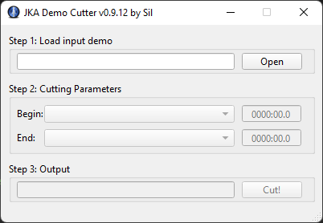
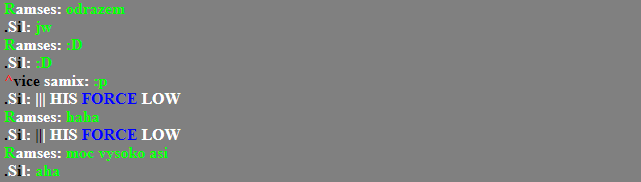

This repository contains C/C++ utilities I made long time ago for parsing the Jedi Academy demo files (*.dm_26). In 2022 I've stumbled upon it on my drive and I've decided to put it on Github before it gets lost. This project is no longer developed or maintained. The code is almost exactly as it was when the last the update was done in 2013, only recent changes have been done to integrate it with latest Qt 6.X.X and also with conan and cmake.

To properly download and build the dependencies (basically just Qt and its dependencies), the conan package manager is used.

To make release x64 solution for Visual Studio 2022:

    conan install . --install-folder build --build=missing
    cmake . -G "Visual Studio 17 2022" -B build

Downloading and building all the dependencies will take some time. Solution file will be generated in build/JkaDemoTools.sln. Selecting the desired project and changing the build from Debug to Release compiles fine in VS2022.

Following is a summary of included components based on my recolection. Some of these tools were released on jkhub.org back in the days.

# Demo Manipulator
Common source files for tools for parsing the demo files.

# Demo Cutter
GUI Qt base application for cliping the demo file into shorter and smaller demo file, based on selected time range.

 

Some versions are also released [here](https://jkhub.org/files/file/1342-demo-cutter/).

# Demo Smoother
Command-line tool that optimizes selected demo file for size as well as makes the players movements smoother (remove the "laggy" movements caused by network latency).
Example use:

    DemoSmoother 1431_ctf4.dm_26 1431_ctf4_smoothered.dm_26

# Demo Chat Extractor
Command-line tool for extracting chat from the demo into either text file or html file (with colors formated). Example use:

    DemoChatExtractor 1952_ctf_nelvaan.dm_26 chat.html -html

HTML example output:

 
